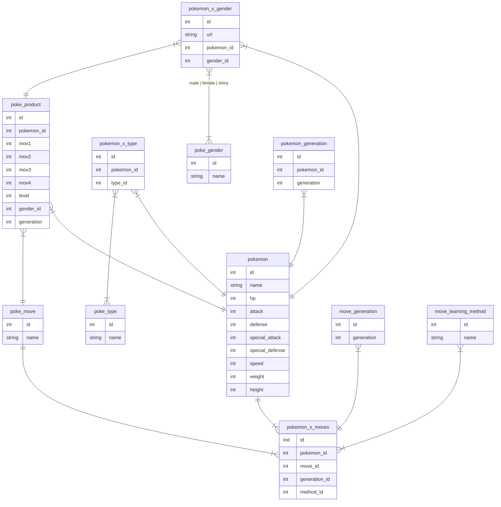

# DB

## Diagram

```mermaid
erDiagram
    pokemon {
        int id
        string name
        int hp
        int attack
        int defense
        int special_attack
        int special_defense
        int speed
        int weight
        int height
    }
    poke_move {
        int id
        string name
    }
    pokemon_x_moves {
        ind id
        int pokemon_id
        int move_id
        int generation_id
        int method_id
    }
    pokemon ||--|{ pokemon_x_moves:""
    poke_move ||--|{ pokemon_x_moves:""
    
    poke_product {
        int id
        int pokemon_id
        int mov1
        int mov2
        int mov3
        int mov4
        int level
        int gender_id
        int generation 
    }
    poke_product }|--|| pokemon:""
    poke_product }|--|| poke_move:""
    poke_type{
        int id
        string name
    }
    pokemon_x_type {
        int id
        int pokemon_id
        int type_id
    }
    pokemon_x_type }|--|| pokemon:""
    pokemon_x_type }|--|{ poke_type:""
    poke_gender {
        int id
        string name
    }
    pokemon_x_gender {
        int id
        string url
        int pokemon_id
        int gender_id
    }
    pokemon_x_gender }|--|| pokemon:""
    pokemon_x_gender }|--|{ poke_gender:"male | female | shiny"
    pokemon_x_gender }|--|| poke_product:""
    move_generation {
        int id
        int generation
    }
    move_learning_method {
        int id
        string name
    }
    move_generation }|--|| pokemon_x_moves:""
    move_learning_method }|--|{ pokemon_x_moves:""
    pokemon_generation{
        int id
        int pokemon_id
        int generation
    }
    pokemon_generation }|--|| pokemon:""
```