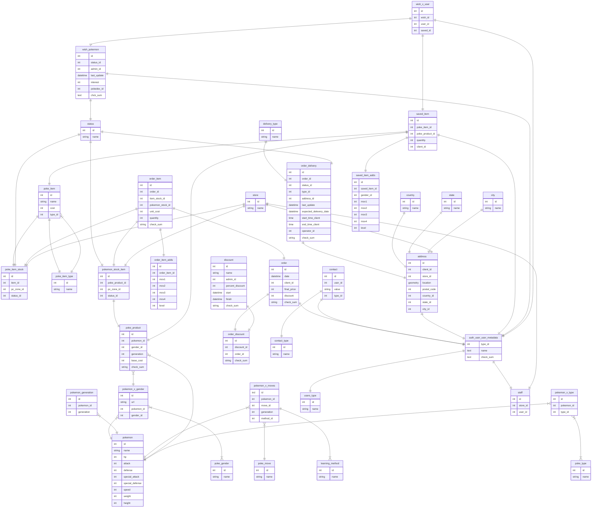

# DB

## Diagram

```mermaid
erDiagram
    pokemon {
        int id
        string name
        int hp
        int attack
        int defense
        int special_attack
        int special_defense
        int speed
        %% base stats 0 < baseStat < 256
        int weight
        %% weight > 0
        int height
        %% height > 0
    }

    poke_gender {
        int id
        string name
    }

    learning_method {
        int id
        string name
    }

    poke_move {
        int id
        string name
    }

    poke_type{
        int id
        string name
    }

    pokemon_x_gender {
        int id
        string url
        int pokemon_id
        int gender_id
    }

    pokemon_x_gender }|--|| pokemon:""
    pokemon_x_gender }|--|{ poke_gender:""
    
%% lista de generaciones de cada pokemon 
    pokemon_generation{
        int id
        int pokemon_id
        int generation
        %% generation > 0
    }
    pokemon_generation }|--|| pokemon:""

    pokemon_x_moves {
        ind id
        int pokemon_id
        int move_id
        int generation
        %% generation > 0
        int method_id
    }

    pokemon_x_moves }|--|| pokemon:""
    pokemon_x_moves }|--|| poke_move:""
    pokemon_x_moves ||--|{ learning_method:""
    
    poke_product {
        int id
        int pokemon_id
        int gender_id
        int generation
        %% generation > 0
        int base_cost
        %% base_cost > 0
        string check_sum 
    }

    poke_product }|--|| pokemon:""
    poke_product }|--|| pokemon_x_gender:""
    %% gender_id = pokemon_x_gender.id


    pokemon_x_type {
        int id
        int pokemon_id
        int type_id
    }

    pokemon_x_type }|--|| pokemon:""
    pokemon_x_type }|--|{ poke_type:""
%% Pokeballs, Heals, Antidoques, Berrys
    poke_item{
        int id
        string name
        int cost
        int type_id
    }
    poke_item_stock{
        int id
        int item_id
        int pc_zone_id
        int status_id
    }
    poke_item ||--|| poke_item_stock:""
    poke_item_type{
        int id
        string name
    }
    poke_item ||--|| poke_item_type:""
    status{
        int id
        string name
    }
    status ||--|| poke_item_stock:""
    status ||--|| pokemon_stock_item:""
    poke_item }|--|| poke_item_type:""
    pokemon_stock_item{
        int id
        int poke_product_id
        int pc_zone_id
        int status_id
    }
    pokemon_stock_item ||--|| poke_product:""
    order_item {
        int id
        int order_id
        int item_stock_id
        int pokemon_stock_id
        int unit_cost
        int quantity
        %% nulleable item_id y pokemon_id
        %% pero hacer un check para que solo uno sea null
        string check_sum
    }
    order_item ||--|| poke_item_stock:""
    order_item ||--|| pokemon_stock_item:""
    order_item ||--|| order_item_adds:""
    order_item ||--|| order:""
    order_item_adds{
        int id
        int order_item_id
        int mov1
        int mov2
        int mov3
        int mov4
        int level
    }
    order{
        int id
        datetime date
        int client_id
        int final_price
        int discount
        string check_sum
    }
    order ||--|| order_discount:""
    order_discount{
        int id
        int discount_id
        int order_id
        string check_sum
    }
    discount{
        int id
        string name
        int admin_id
        int percent_discount
        datetime start
        datetime finish
        string check_sum
    }
    discount ||--|| order_discount:""
    delivery_type{
        int id
        string name
    }
    delivery_type ||--|| order_delivery:""
    order_delivery{
        int id
        int order_id
        int status_id
        int type_id
        int address_id
        datetime last_update
        datetime expected_delevery_date
        time start_time_client
        time end_time_client
        int operator_id
        string check_sum
    }
    status ||--|| order_delivery:""
    order_delivery ||--|| address:""
    address {
        int id
        int client_id
        int store_id
        geometry location
        int postal_code
        int country_id
        int state_id
        int city_id
        %% client y store id puede ser null
        %% pero hay que hacer check para que solo uno sea null
    }
    country{
        int id
        string name
    }
    country ||--|| address:""
    state{
        int id
        string name
    }
    state ||--|| address:""
    city{
        int id
        string name
    }
    city ||--|| address:""
    contact{
        int id
        int user_id
        string value
        int type_id
    }
    contact_type{
        int id
        string name
    }
    contact ||--|| contact_type:""
    %% auth.user.user_metadata
    auth_user_user_metadata{
    %% id of auth.user
        int type_id
        text name
        text check_sum
    }
    contact ||--|| auth_user_user_metadata:""
    order ||--|| auth_user_user_metadata:""
    address ||--|| auth_user_user_metadata:""
    users_type{
        int id
        string name
    }
    auth_user_user_metadata||--|| users_type:""
    store{
        int id
        string name
    }
    store ||--|| address:""
    store ||--|| poke_item_stock:""
    store ||--|| pokemon_stock_item:""
    staff{
        int id
        int store_id
        int user_id
    }
    auth_user_user_metadata||--|| staff:""
    store ||--|| staff:""
    saved_item{
        int id
        int poke_item_id
        int poke_product_id
        int quantity
        int client_id
        %% nulleable item_id y pokemon_id
        %% pero hacer un check para que solo uno sea null
    }
    saved_item ||--|| auth_user_user_metadata:""
    saved_item ||--|| poke_item:""
    saved_item ||--|| poke_product:""
    saved_item_adds{
        int id
        int saved_item_id
        int gender_id
        int mov1
        int mov2
        int mov3
        int mov4
        int level
    }
    saved_item ||--|| saved_item_adds:""
    wish_pokemon{
        int id
        int status_id
        int admin_id
        datetime last_update
        int interest
        %% cantidad de usuarios que quieren el pokemon
        int pokedex_id
        %% pokedex_id no es llave foranea 
        text chck_sum
    }
    wish_pokemon ||--|| status:""
    wish_pokemon ||--|| auth_user_user_metadata:""
    wish_x_user{
        int id
        int wish_id
        int user_id
        int saved_id
    }
    wish_x_user ||--|| auth_user_user_metadata:""
    wish_x_user ||--|| wish_pokemon:""
    wish_x_user ||--|| saved_item:""

```