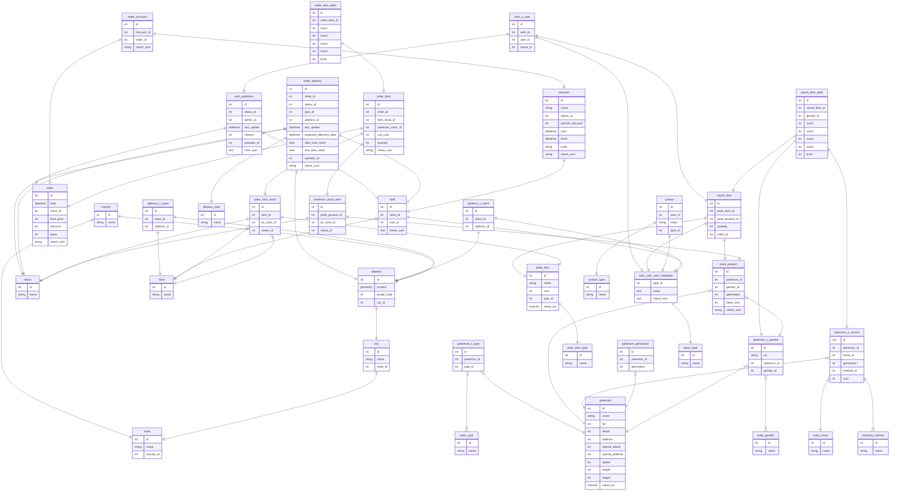

# DB

## Diagram

```mermaid
erDiagram
    pokemon {
        int id
        string name
        int hp
        int attack
        int defense
        int special_attack
        int special_defense
        int speed
        %% base stats 0 < baseStat < 256
        int weight
        %% weight > 0
        int height
        %% height > 0
        tsvector name_tsv
    }

    poke_gender {
        int id
        string name
    }

    learning_method {
        int id
        string name
    }

    poke_move {
        int id
        string name
    }

    poke_type{
        int id
        string name
    }

    pokemon_x_gender {
        int id
        string url
        int pokemon_id
        int gender_id
    }

    pokemon_x_gender }|--|| pokemon:""
    pokemon_x_gender }|--|{ poke_gender:""
    
%% lista de generaciones de cada pokemon 
    pokemon_generation{
        int id
        int pokemon_id
        int generation
        %% generation > 0
    }
    pokemon_generation }|--|| pokemon:""

    pokemon_x_moves {
        ind id
        int pokemon_id
        int move_id
        int generation
        %% generation > 0
        int method_id
        int cost
    }

    pokemon_x_moves }|--|| pokemon:""
    pokemon_x_moves }|--|| poke_move:""
    pokemon_x_moves ||--|{ learning_method:""
    
    poke_product {
        int id
        int pokemon_id
        int gender_id
        int generation
        %% generation > 0
        int base_cost
        %% base_cost > 0
        string check_sum 
    }

    poke_product }|--|| pokemon:""
    poke_product }|--|| pokemon_x_gender:""
    %% gender_id = pokemon_x_gender.id


    pokemon_x_type {
        int id
        int pokemon_id
        int type_id
    }

    pokemon_x_type }|--|| pokemon:""
    pokemon_x_type }|--|{ poke_type:""

    poke_item_type{
        int id
        string name
    }

    status{
        int id
        string name
    }

    store{
        int id
        string name
    }

%% Pokeballs, Heals, Antidoques, Berrys
    poke_item{
        int id
        string name
        int cost
        %% cost > 0
        int type_id
        tsvector name_tsv
    }

    poke_item ||--|| poke_item_type:""

    poke_item_stock{
        int id
        int item_id
        int pc_zone_id
        int status_id
    }

    poke_item_stock ||--|| poke_item:""
    poke_item_stock ||--|| status:""
    poke_item_stock }|--|| store:""
    %% pc_zone_id = store.id

    pokemon_stock_item{
        int id
        int poke_product_id
        int pc_zone_id
        int status_id
    }

    pokemon_stock_item ||--|| poke_product:"" 
    poke_item_stock }|--|| store:""
    %% pc_zone_id = store.id
    pokemon_stock_item ||--|| status:""   

    order{
        int id
        datetime date
        int client_id
        %% cliend_id = FK auth.users.id
        int final_price
        %% final_price NUMERIC(10, 2)
        int discount
        %% discount NUMERIC(10, 2)
        int taxes
        %% taxes NUMERIC(10, 2)
        string check_sum
    }

    order_item {
        int id
        int order_id
        int item_stock_id
        int pokemon_stock_id
        %% nulleable item_id y pokemon_id
        %% pero hacer un check para que solo uno sea null
        int unit_cost
        %% unit_cost > 0
        int quantity
        %% quantity > 0
        string check_sum
    }

    order_item ||--|| order:""
    order_item ||--|| poke_item_stock:""
    order_item ||--|| pokemon_stock_item:""
    
    order_item_adds{
        int id
        int order_item_id
        int mov1
        %% mov1 = FK pokemon_x_moves.id
        int mov2
        %% mov2 = FK pokemon_x_moves.id
        int mov3
        %% mov3 = FK pokemon_x_moves.id
        int mov4
        %% mov4 = FK pokemon_x_moves.id
        int level
        %% level > 0
    }

    order_item_adds ||--|| order_item:""

    discount{
        int id
        string name
        int admin_id
        %% CONSTRAINT fk_admin FOREIGN KEY (admin_id) REFERENCES staff (id) ON DELETE CASCADE
        int percent_discount
        datetime start
        datetime finish
        %% check start before finish
        string code
        string check_sum
    }

    discount||--|| staff:""
    
    order_discount{
        int id
        int discount_id
        int order_id
        string check_sum
    }

    order_discount ||--|| discount:""
    order_discount ||--|| order:""

    country{
        int id
        string name
    }

    country ||--|| address:""
    
    state{
        int id
        string name
        int country_id
    }
    
    state ||--|| country:""
    
    city{
        int id
        string name
        int state_id
    }
    
    city ||--|| state:""
    
    delivery_type{
        int id
        string name
    }

    contact_type{
        int id
        string name
    }

    users_type{
        int id
        string name
    }

    address {
        int id
        geometry location
        int postal_code
        int city_id
    }

    address ||--|| city:""

    auth_user_user_metadata{
    %% id of auth.users
        int type_id
        text name
        text check_sum
    }

    auth_user_user_metadata||--|| users_type:""

    staff{
        int id
        int store_id
        int user_id
        %% CONSTRAINT fk_user FOREIGN KEY (user_id) REFERENCES auth.users (id) ON DELETE CASCADE
        text check_sum
    }

    staff||--|| auth_user_user_metadata:""
    staff||--|| store:""

    address_x_store {
        int id
        int store_id
        int address_id
    }

    address_x_store ||--|| address:""
    address_x_store ||--|| store:""

    address_x_client {
        int id
        int client_id 
        %% CONSTRAINT fk_client FOREIGN KEY (client_id) REFERENCES auth.users (id) ON DELETE CASCADE
        int address_id
    }
    address_x_client ||--|| address:""
    address_x_client ||--|| auth_user_user_metadata:""
    
    order_delivery{
        int id
        int order_id
        int status_id
        int type_id
        int address_id
        datetime last_update
        datetime expected_delevery_date
        time start_time_client
        time end_time_client
        %% start_time_client before end_time_client
        int operator_id
        %% CONSTRAINT fk_operator FOREIGN KEY (operator_id) REFERENCES staff (id) ON DELETE CASCADE,
        string check_sum
    }

    order_delivery ||--|| order:""
    order_delivery ||--|| status:""
    order_delivery ||--|| delivery_type:""
    order_delivery ||--|| address:""
    order_delivery ||--|| staff:""

    contact{
        int id
        int user_id
        %% CONSTRAINT fk_user FOREIGN KEY (user_id) REFERENCES auth.users (id) ON DELETE CASCADE
        string value
        int type_id
    }

    contact ||--|| contact_type:""
    contact ||--|| auth_user_user_metadata:""


    saved_item{
        int id
        int poke_item_id
        int poke_product_id
        int quantity
        %% quantity > 0
        int client_id
        %% nulleable item_id y pokemon_id
        %% pero hacer un check para que solo uno sea null
    }

    saved_item ||--|| auth_user_user_metadata:""
    saved_item ||--|| poke_item:""
    saved_item ||--|| poke_product:""

    saved_item_adds{
        int id
        int saved_item_id
        int gender_id
        %% CONSTRAINT fk_gender FOREIGN KEY (gender_id) REFERENCES pokemon_x_gender (id) ON DELETE CASCADE
        int mov1
        %% CONSTRAINT fk_mov1 FOREIGN KEY (mov1) REFERENCES pokemon_x_moves (id) ON DELETE CASCADE 
        int mov2
        %% CONSTRAINT fk_mov2 FOREIGN KEY (mov1) REFERENCES pokemon_x_moves (id) ON DELETE CASCADE 
        int mov3
        %% CONSTRAINT fk_mov3 FOREIGN KEY (mov1) REFERENCES pokemon_x_moves (id) ON DELETE CASCADE 
        int mov4
        %% CONSTRAINT fk_mov4 FOREIGN KEY (mov1) REFERENCES pokemon_x_moves (id) ON DELETE CASCADE 
        int level
        %% level > 0
    }

    saved_item_adds ||--|| saved_item:""
    saved_item_adds ||--|| pokemon_x_gender:""
    saved_item_adds ||--|| pokemon_x_moves:""

    wish_pokemon{
        int id
        int status_id
        int admin_id
        %% CONSTRAINT fk_admin FOREIGN KEY (admin_id) REFERENCES staff (id) ON DELETE CASCADE
        datetime last_update
        int interest
        %% cantidad de usuarios que quieren el pokemon
        int pokedex_id
        %% pokedex_id no es llave foranea 
        text chck_sum
    }

    wish_pokemon ||--|| status:""
    wish_pokemon ||--|| staff:""

    wish_x_user{
        int id
        int wish_id
        int user_id
        %% CONSTRAINT fk_user FOREIGN KEY (user_id) REFERENCES auth.users (id) ON DELETE CASCADE
        int saved_id
    }

    wish_x_user ||--|| wish_pokemon:""
    wish_x_user ||--|| auth_user_user_metadata:""
    wish_x_user ||--|| saved_item:""

```